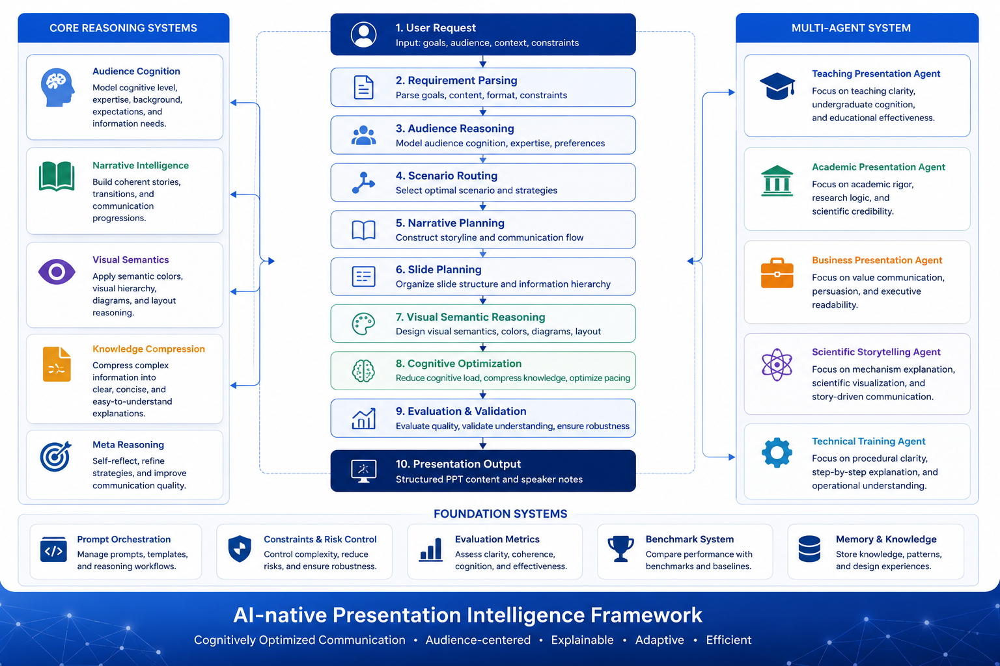
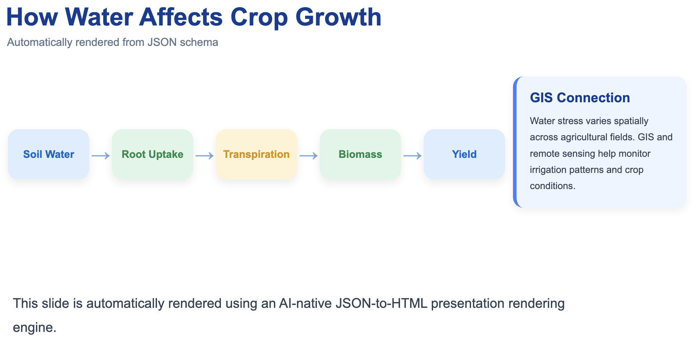

# AI-Native Presentation Cognition System

An AI-native cognition architecture for generating,
evaluating,
revising,
and stabilizing
high-quality presentations
through audience-aware communication orchestration.

This project is NOT:

- a PPT template repository
- a generic slide generator
- a visual beautification toolkit
- a prompt collection

This project IS:

a presentation cognition operating system.

---

# Overview

Traditional AI presentation systems mainly optimize:

- template filling
- visual beautification
- layout decoration
- slide rendering

This framework optimizes:

- cognitive communication
- audience understanding
- hierarchy orchestration
- mechanism interpretation
- narrative reasoning
- visual cognition stabilization

The objective is NOT:

maximum visual complexity.

The objective IS:

maximum communication effectiveness.

Presentations generated by this system should feel:

- editorially grounded
- cognitively intentional
- visually restrained
- human-designed
- audience-aware

---

# Core Vision

Most AI PPT systems operate as:

```text
Content
→
Layout
→
Rendered Slides
```

This framework operates as:

```text
User Intent
    ↓
Audience Modeling
    ↓
Cognitive Routing
    ↓
Narrative Planning
    ↓
Hierarchy Orchestration
    ↓
Mechanism / Concept Planning
    ↓
Density Regulation
    ↓
Visual Stabilization
    ↓
Evaluation
    ↓
Iterative Refinement
    ↓
Executable Presentation
```

This is NOT:

slide generation.

This IS:

communication cognition engineering.

---

# System Architecture



---

# AI-Native Cognition Pipeline

```text
User Goal
    ↓
Entry Routing
    ↓
Command Activation
    ↓
Workflow Orchestration
    ↓
Skill Regulation
    ↓
Prompt Engine Execution
    ↓
Reference Grounding
    ↓
Example Grounding
    ↓
Hierarchy Planning
    ↓
Density Regulation
    ↓
Evaluation
    ↓
Revision Loop
    ↓
Final Stabilization
```

The pipeline continuously regulates:

- audience adaptation
- communication clarity
- cognitive density
- hierarchy stability
- editorial atmosphere
- teaching accessibility
- professional trust

---

# Repository Architecture

```text
architecture/
commands/
entry/
evaluation/
examples/
prompts/
references/
skills/
styles/
workflow/
rendering/
assets/
```

---

# System Modules

## architecture/

System-level cognition design.

Defines:

- cognition pipeline
- orchestration logic
- system execution structure

Examples:

- system_architecture.md
- cognition_pipeline.md

---

## commands/

User-facing cognition routers.

Responsible for:

- scenario activation
- workflow selection
- communication strategy routing

Examples:

- paper_to_ppt.md
- faculty_interview_ppt.md
- teaching_demo_ppt.md

---

## workflow/

High-level cognition orchestration systems.

Responsible for:

- audience modeling
- narrative sequencing
- hierarchy planning
- density regulation
- evaluation loops

Examples:

- academic_workflow.md
- interview_workflow.md
- teaching_workflow.md
- revision_workflow.md

---

## skills/

Behavior regulation systems.

Responsible for:

- communication tone
- professionalism
- scientific depth
- educational accessibility
- hierarchy preference

Examples:

- academic_skill/
- interview_skill/
- teaching_skill/

---

## prompts/

Cognition execution engines.

Responsible for:

- scientific storytelling
- faculty communication
- teaching cognition
- density optimization
- slide diagnosis
- revision behavior

Examples:

- scientific_storytelling_engine.md
- faculty_interview_engine.md
- teaching_cognition_engine.md
- cognitive_density_engine.md
- revision_engine.md
- slide_diagnosis_engine.md

---

## references/

Reusable visual cognition grammar.

Responsible for:

- hierarchy systems
- whitespace behavior
- mechanism layouts
- semantic visual language
- editorial visual behavior

Examples:

- hierarchy_patterns.md
- whitespace_patterns.md
- mechanism_layout_patterns.md
- scientific_visual_language.md
- teaching_visual_language.md
- faculty_visual_language.md

---

## examples/

Grounded cognition priors.

Responsible for:

- storytelling grounding
- hierarchy reasoning
- revision interpretation
- educational pacing

Examples:

- academic_case.md
- interview_case.md
- teaching_case.md
- revision_case.md

Examples are:

grounded cognition references,
NOT templates.

---

## styles/

Visual atmosphere systems.

Responsible for:

- typography behavior
- spacing rhythm
- semantic colors
- editorial atmosphere
- visual calmness

Examples:

- sci_top_journal/
- faculty_interview/
- teaching_clean/

---

## evaluation/

Communication quality stabilization systems.

Responsible for evaluating:

- cognitive clarity
- mechanism readability
- hierarchy stability
- professionalism
- educational accessibility
- communication effectiveness

Evaluation is NOT:

beauty scoring.

It IS:

cognitive communication assessment.

---

## rendering/

Semantic rendering infrastructure.

Responsible for:

- JSON slide interpretation
- executable HTML generation
- semantic rendering behavior
- hierarchy-aware rendering
- adaptive visual execution

---

# Current System Capabilities

| Capability | Status |
|---|---|
| Audience Modeling | ✅ |
| Narrative Planning | ✅ |
| Workflow Orchestration | ✅ |
| Cognitive Density Regulation | ✅ |
| Mechanism Storytelling | ✅ |
| Scientific Communication | ✅ |
| Teaching Communication | ✅ |
| Faculty Interview Communication | ✅ |
| Revision & Diagnosis Engine | ✅ |
| Evaluation System | ✅ |
| JSON Rendering Pipeline | ✅ |
| HTML Presentation Rendering | ✅ |

---

# Supported Presentation Modes

## Scientific Presentations

Optimized for:

- conferences
- thesis defenses
- research seminars
- journal presentations
- mechanism communication

Prioritizes:

- mechanism clarity
- evidence hierarchy
- editorial scientific storytelling

---

## Faculty Interview Presentations

Optimized for:

- academic recruitment
- job talks
- teaching interviews
- institutional presentations

Prioritizes:

- professional trust
- strategic positioning
- institutional calmness

---

## Teaching Demonstrations

Optimized for:

- undergraduate teaching
- classroom lectures
- educational explanation
- concept teaching

Prioritizes:

- conceptual accessibility
- visual explanation
- progressive learning

---

# Rendering Demonstration

The framework already supports:

```text
Reasoning
→
Narrative Planning
→
Hierarchy Orchestration
→
JSON Slide Schema
→
Automatic HTML Rendering
→
Executable Presentation
```

---

## Example Rendered Slide



---

# Example JSON Slide Schema

```json
{
  "slide_type": "mechanism_flow",

  "title": "How Water Affects Crop Growth",

  "layout": "horizontal_flow",

  "components": [

    {
      "type": "box",
      "label": "Soil Water",
      "semantic": "water"
    },

    {
      "type": "arrow",
      "label": "→"
    },

    {
      "type": "box",
      "label": "Root Uptake",
      "semantic": "growth"
    }

  ]
}
```

---

# Cognitive Design Principles

## 1. Communication Before Decoration

The system optimizes:

understanding quality,
NOT visual complexity.

---

## 2. Hierarchy Before Density

Presentations must establish:

clear dominant structures.

Avoid:

equal-weight layouts.

---

## 3. Mechanism Before Results

Scientific presentations should explain:

why,
NOT only what.

Mechanism communication dominates:

scientific storytelling.

---

## 4. Reduction Before Addition

When communication fails:

reduce complexity first.

Avoid:

decorative escalation.

---

## 5. Audience Before Content

Presentation quality depends on:

audience interpretability,
NOT information quantity.

---

# Revision Philosophy

Presentation revision is NOT:

continuous redesign.

It IS:

iterative cognitive alignment.

The system prioritizes:

- local refinement
- hierarchy stabilization
- communication correction
- density optimization
- narrative preservation

while preserving:

- presentation identity
- visual atmosphere
- audience adaptation

---

# Anti-AI-Slop Principles

The system actively prevents:

- infographic-heavy layouts
- startup pitch aesthetics
- SaaS dashboard composition
- glowing AI visuals
- decorative overproduction
- equal-weight hierarchy collapse

The system should produce presentations that feel:

editorial,
restrained,
and human-designed.

---

# Long-Term Vision

The long-term goal is to build:

a fully AI-native presentation operating system

capable of:

- audience-aware cognition orchestration
- adaptive hierarchy planning
- semantic visual systems
- executable slide rendering
- iterative communication refinement
- mechanism-centered storytelling
- educational cognition adaptation

from high-level human intent.

---

# Project Status

Current stage:

```text
AI-Native Presentation Cognition Architecture
+
Executable Rendering Prototype
```

The framework already supports:

```text
Intent Interpretation
→
Cognition Routing
→
Narrative Planning
→
Hierarchy Orchestration
→
JSON Schema
→
Automatic HTML Rendering
→
Executable Presentation
```

---

# Showcase

See:

```text
SHOWCASE.md
```

for:

- rendering demonstrations
- cognition pipeline examples
- architecture explanations
- JSON rendering examples
- workflow orchestration examples

---

# Disclaimer

This repository is intended for:

- research
- educational exploration
- AI cognition systems
- presentation communication studies
- human-AI communication experiments

Commercial deployment and high-risk usage should be independently evaluated by users.

---

# License

MIT License

---

# Final Philosophy

Presentations are NOT:
decorative artifacts.

They ARE:

audience cognition interfaces
for orchestrated communication engineering.

The goal is NOT:

to generate prettier slides.

The goal IS:

to help humans communicate
complex knowledge
more clearly,
more efficiently,
and with lower cognitive burden.
